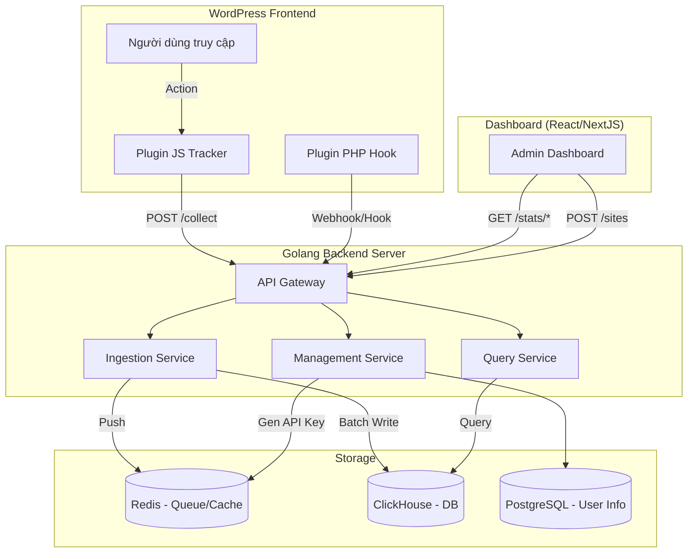

Để xây dựng một hệ thống Analytics SaaS hoàn chỉnh theo mô hình bạn mô tả, bạn cần thiết kế các nhóm API cụ thể cho từng đối tượng sử dụng: **Plugin WordPress (Client)**, **Dashboard Admin (Frontend)** và **Hệ thống nội bộ**.

Dưới đây là danh sách các API cần thiết, được chia theo nhóm chức năng:

---

### 1. API Nhóm Thu thập dữ liệu (Ingestion APIs)
Đây là các API "hứng" dữ liệu từ Plugin WordPress. Yêu cầu quan trọng nhất là **tốc độ (latency thấp)** và **khả năng chịu tải cao**.

| Method | Endpoint | Mô tả |
| :--- | :--- | :--- |
| **POST** | `/api/v1/collect` | **API chính.** Nhận mọi sự kiện (pageview, click, purchase...). Payload là JSON chứa thông tin event, user, attribution. |
| **POST** | `/api/v1/batch` | **(Tối ưu)** Nhận một mảng các sự kiện cùng lúc (thay vì gửi từng cái). Giúp giảm số lượng request HTTP. |
| **GET** | `/api/v1/verify` | Plugin gọi endpoint này khi nhập "Mã kết nối" để kiểm tra xem Key có hợp lệ không và lấy cấu hình tracking (ví dụ: có bật track admin không?). |

**Xử lý tại Golang:**
*   Validate `api_key` / `site_id`.
*   Parse dữ liệu.
*   Đẩy vào Queue (Redis/Kafka) hoặc ghi trực tiếp batch vào ClickHouse.

---

### 2. API Nhóm Quản lý Website & Người dùng (Management APIs)
Dùng cho Dashboard Admin (nơi người dùng đăng ký, thêm website, lấy mã nhúng).

| Method | Endpoint | Mô tả |
| :--- | :--- | :--- |
| **POST** | `/api/v1/auth/register` | Đăng ký tài khoản mới. |
| **POST** | `/api/v1/auth/login` | Đăng nhập, trả về JWT Token. |
| **POST** | `/api/v1/sites` | **Tạo website mới.** User nhập tên miền -> System sinh ra `site_id` và `api_key` (Mã kết nối). |
| **GET** | `/api/v1/sites` | Lấy danh sách website của user đang đăng nhập. |
| **PUT** | `/api/v1/sites/{site_id}` | Cập nhật cấu hình (tên website, timezone, currency). |
| **DELETE** | `/api/v1/sites/{site_id}` | Xóa website (Cẩn thận: Cần policy xóa dữ liệu trong ClickHouse). |
| **GET** | `/api/v1/sites/{site_id}/tracking-code` | Trả về đoạn script JS hoặc mã PHP cần thiết để user copy vào WP. |

---

### 3. API Nhóm Báo cáo & Biểu đồ (Reporting APIs)
Được gọi bởi Dashboard Frontend (hoặc Plugin WP nếu có nhúng biểu đồ ngay trong admin WP). Các API này sẽ query ClickHouse.

| Method | Endpoint | Mô tả |
| :--- | :--- | :--- |
| **GET** | `/api/v1/stats/overview` | Lấy số liệu tổng quan (Cards): Total Visits, Unique Users, Total Revenue, CR. Query params: `site_id`, `from`, `to`. |
| **GET** | `/api/v1/stats/trend` | Dữ liệu vẽ biểu đồ đường (Line Chart) theo thời gian (Ngày/Tuần/Tháng). Trả về: Date, Visits, Revenue. |
| **GET** | `/api/v1/stats/sources` | Biểu đồ tròn/cột nguồn truy cập. Trả về danh sách Source (Google, FB, Direct) kèm số lượng sessions. |
| **GET** | `/api/v1/stats/pages` | Top Pages xem nhiều nhất. Bảng xếp hạng URL theo Pageviews. |
| **GET** | `/api/v1/stats/products` | Top sản phẩm WooCommerce bán chạy nhất. |
| **GET** | `/api/v1/stats/events` | Danh sách sự kiện gần nhất (Real-time feed): "User A vừa mua hàng...", "User B vừa xem...". |
| **GET** | `/api/v1/stats/realtime` | Số lượng người đang online trên web tại thời điểm query. |

**Logic Query ClickHouse:**
*   Các API này sẽ map trực tiếp sang câu lệnh SQL `SELECT` đã discussed ở câu trả lời trước (dùng `uniqExact`, `sum`, `group by`).

---

### 4. Sơ đồ luồng dữ liệu (Data Flow)

### 5. Một số lưu ý kỹ thuật khi xây dựng API

1.  **Authentication (Xác thực):**
    *   **Ingestion API (`/collect`):** Dùng `X-Api-Key` header đơn giản (nhanh). Không cần JWT vì đây là request công khai từ plugin.
    *   **Management & Reporting API:** Bắt buộc dùng `Bearer JWT Token` (User phải đăng nhập mới xem được dashboard hoặc tạo site).

2.  **CORS (Cross-Origin Resource Sharing):**
    *   Endpoint `/collect` cần cấu hình CORS cho phép request từ **bất kỳ domain nào** (*), vì plugin sẽ cài trên hàng ngàn domain khác nhau của khách hàng.
    *   Các API Dashboard thì chỉ cho phép request từ domain Dashboard của bạn.

3.  **Rate Limiting (Giới hạn request):**
    *   Cần implement rate limit cho `/collect` (ví dụ: tối đa 100 request/giây/site) để tránh một site bị lỗi spam làm sập hệ thống.

Bằng cách chia tách rõ ràng các nhóm API này, bạn có thể phát triển song song: Team Backend lo phần Ingestion & ClickHouse, Team Frontend lo Dashboard và Plugin.