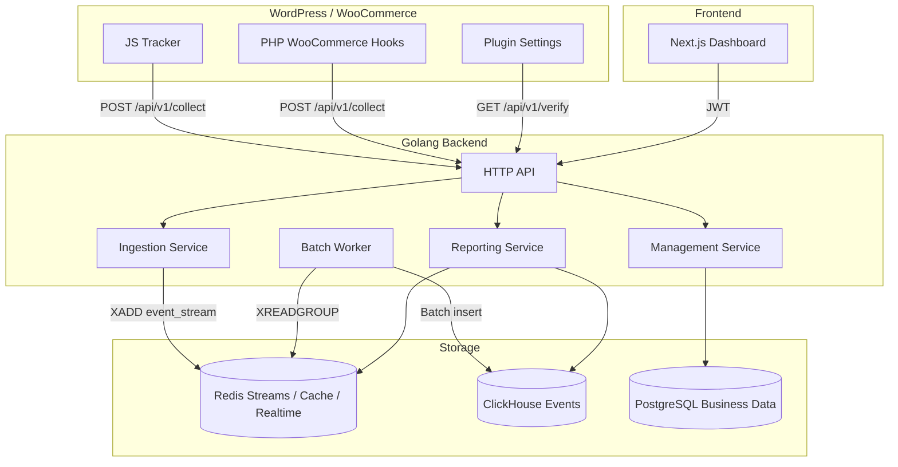

# Plan: Woosaas - Analytics SaaS cho WordPress/WooCommerce

> **Mục tiêu:** Xây dựng nền tảng analytics cho shop WordPress/WooCommerce, tập trung trước vào tracking, attribution, doanh thu, funnel và dashboard vận hành được. Các phần lớn như support/helpdesk, bot detection nâng cao và customer 360 được tách sang phase sau MVP.

> **Stack:** WordPress Plugin + Golang API + ClickHouse + PostgreSQL + Redis + Next.js

---

## 1. Định hướng sản phẩm

Woosaas giúp chủ shop WooCommerce trả lời các câu hỏi quan trọng:

| Câu hỏi | Tính năng |
|--------|-----------|
| Khách đến từ nguồn nào? | Attribution UTM, click ID, referrer, direct |
| Trang/sản phẩm nào tạo doanh thu? | Page, product, order analytics |
| Funnel rớt ở bước nào? | View product -> add to cart -> checkout -> purchase |
| Hiện có bao nhiêu người đang online? | Realtime users bằng Redis ZSET |
| Có bot làm nhiễu số liệu không? | Bot scoring và bot report |

### MVP cần đạt

- WordPress plugin cài được trên site WooCommerce.
- Tracking pageview, session, client, UTM/referrer/click ID.
- Tracking ecommerce events: product view, add to cart, checkout, purchase.
- Backend nhận event an toàn, batch insert vào ClickHouse.
- Dashboard hiển thị overview, trend, sources, pages, products, funnel, realtime.
- Site owner tạo site, lấy API key/tracking code, verify tracking.

### Chưa làm trong MVP

- Helpdesk/support system.
- Billing/subscription.
- Email inbound/outbound.
- Customer 360 nâng cao.
- Bot blocking cứng.
- Cross-device attribution.

---

## 2. Kiến trúc tổng thể



### Nguyên tắc kiến trúc

- ClickHouse chỉ dùng cho event analytics.
- PostgreSQL lưu user, site, API key, cấu hình, subscription sau này.
- Redis dùng cho stream ingestion, API key cache, rate limit, realtime online users.
- Mọi query analytics phải filter theo `site_id`.
- Event ingestion phải idempotent theo `site_id + event_id`.
- Không ghi từng event vào ClickHouse; luôn batch insert.

---

## 3. Module chính

### 3.1 WordPress Plugin

### Chức năng MVP

| Module | Mô tả |
|--------|-------|
| JS Tracker | Tạo `client_id`, `session_id`, gửi pageview và browser events |
| Attribution | Parse UTM, click ID, referrer, direct; lưu cookie |
| Woo Hooks | Gửi add to cart, checkout, purchase từ server-side PHP |
| Settings Page | Nhập API key, verify site, bật/tắt tracking |

### Cookie cần dùng

| Cookie | TTL | Mục đích |
|--------|-----|----------|
| `woosaas_client_id` | 12 tháng | Nhận diện visitor ẩn danh |
| `woosaas_session_id` | 30 phút inactivity | Gom event thành session |
| `woosaas_attribution` | 90 ngày | Lưu source/medium/campaign/click ID |

### Attribution rule

Thứ tự ưu tiên khi bắt đầu session mới:

1. UTM: `utm_source`, `utm_medium`, `utm_campaign`, `utm_term`, `utm_content`.
2. Click ID: `gclid`, `fbclid`, `ttclid`, `msclkid`.
3. Referrer external: phân loại search, social, referral.
4. Existing attribution cookie.
5. Direct.

Quy tắc quan trọng:

- Direct không ghi đè nguồn non-direct còn hạn.
- Purchase phải lấy attribution đã lưu ở checkout/order meta.
- Mỗi order WooCommerce cần lưu `client_id`, `session_id`, `attribution` vào order meta.
- Attribution MVP dùng last non-direct click.

### Events MVP

| Event | Nguồn | Ghi chú |
|-------|-------|---------|
| `pageview` | JS | Gửi khi load page |
| `product_view` | JS/PHP | Có `product_id` nếu là trang sản phẩm |
| `add_to_cart` | PHP hook | Có product, quantity |
| `checkout_start` | PHP/JS | Khi vào checkout |
| `purchase` | PHP hook | Có order_id, revenue, currency, items |

---

### 3.2 Golang Backend

### Services

| Service | Trách nhiệm |
|---------|-------------|
| API | Routing, auth, CORS, rate limit, request validation |
| Ingestion | Validate event, normalize payload, push Redis Stream |
| Worker | Đọc Redis Stream, batch insert ClickHouse, retry lỗi |
| Management | Auth, user, site, API key, tracking code |
| Reporting | Query ClickHouse/Redis cho dashboard |

### Framework đề xuất

Dùng **Gin** cho MVP vì ecosystem phổ biến, middleware nhiều, dễ tuyển người bảo trì. Fiber vẫn phù hợp nếu team đã quen, nhưng không cần tối ưu premature ở giai đoạn đầu.

### Ingestion yêu cầu bắt buộc

- Auth bằng `X-Api-Key`.
- Validate domain của request theo site config nếu có `Origin`/`Referer`.
- Limit body size.
- Validate schema theo event type.
- Generate server `received_at`.
- Deduplicate bằng `event_id`.
- Rate limit theo `site_id` và IP.
- CORS `*` chỉ áp dụng cho `/collect`, không áp dụng dashboard APIs.

### Redis Stream strategy

| Thành phần | Quyết định |
|------------|------------|
| Stream | `events:stream` |
| Consumer group | `ingest-workers` |
| Batch size | 500-2000 events |
| Flush interval | 1-2 giây |
| Retry | Reclaim pending messages |
| Dead letter | `events:dead` sau số lần retry tối đa |

---

### 3.3 Database Design

#### ClickHouse

```sql
CREATE TABLE analytics_events (
    event_date     Date MATERIALIZED toDate(event_time),
    event_time     DateTime64(3),
    received_at    DateTime64(3) DEFAULT now64(3),

    site_id        LowCardinality(String),
    event_id       String,
    event_name     LowCardinality(String),

    client_id      String,
    session_id     String,
    user_id        String,

    url            String,
    path           String,
    referrer       String,

    source         LowCardinality(String),
    medium         LowCardinality(String),
    campaign       String,
    term           String,
    content        String,
    gclid          String,
    fbclid         String,
    ttclid         String,
    msclkid        String,

    device_type    LowCardinality(String),
    browser        LowCardinality(String),
    os             LowCardinality(String),
    country        LowCardinality(String),
    city           String,
    ip_hash        String,
    user_agent     String,

    order_id       String,
    product_id     String,
    product_name   String,
    quantity       UInt32 DEFAULT 0,
    revenue        Decimal(12, 2) DEFAULT 0,
    currency       LowCardinality(String),
    items_json     String,
    properties_json String,

    bot_score      UInt8 DEFAULT 0,
    bot_reason     String,

    INDEX idx_event_id event_id TYPE bloom_filter GRANULARITY 4,
    INDEX idx_session session_id TYPE bloom_filter GRANULARITY 4,
    INDEX idx_client client_id TYPE bloom_filter GRANULARITY 4
) ENGINE = MergeTree()
PARTITION BY toYYYYMM(event_date)
ORDER BY (site_id, event_date, event_name, event_time)
TTL event_date + INTERVAL 12 MONTH DELETE
SETTINGS index_granularity = 8192;
```

### Ghi chú schema

- `event_id` dùng để chống duplicate.
- `ip_hash` thay vì IP raw để giảm rủi ro privacy.
- `items_json` dùng cho order có nhiều sản phẩm; sau MVP có thể tách bảng item-level.
- `properties_json` giữ event custom mà không cần đổi schema liên tục.
- Khi dữ liệu lớn, bổ sung materialized views cho overview theo ngày.

#### PostgreSQL

| Table | Mục đích |
|-------|----------|
| `users` | Tài khoản dashboard |
| `sites` | Website, domain, timezone, currency |
| `api_keys` | API key hash, status, last used |
| `site_members` | Phân quyền user theo site |
| `tracking_verifications` | Trạng thái verify plugin/tracking |

### PostgreSQL phase sau MVP

| Table | Mục đích |
|-------|----------|
| `billing_customers` | Customer billing |
| `subscriptions` | Gói dịch vụ |
| `tickets` | Helpdesk ticket |
| `ticket_messages` | Hội thoại support |
| `customers` | Customer profile nâng cao |

#### Redis

| Key | Type | TTL | Mục đích |
|-----|------|-----|----------|
| `events:stream` | Stream | none | Queue event ingestion |
| `events:dead` | Stream | none | Event lỗi sau retry |
| `api_key:{hash}` | String | 5-15 phút | Cache API key -> site_id |
| `rate:{site_id}:{minute}` | String | 2 phút | Rate limit |
| `online:{site_id}` | ZSET | rolling cleanup | User online gần đây |
| `dedupe:{site_id}:{event_id}` | String | 24-72 giờ | Chống duplicate ngắn hạn |

---

## 4. API Design

### 4.1 Public Ingestion API

| Method | Endpoint | Auth | Mục đích |
|--------|----------|------|----------|
| POST | `/api/v1/collect` | `X-Api-Key` | Nhận một event |
| POST | `/api/v1/batch` | `X-Api-Key` | Nhận nhiều event |
| GET | `/api/v1/verify` | `X-Api-Key` | Plugin kiểm tra API key/site |

### Event payload mẫu

```json
{
  "event_id": "evt_01h...",
  "event_time": "2026-05-04T10:15:30.123Z",
  "event_name": "pageview",
  "client_id": "cid_...",
  "session_id": "sid_...",
  "url": "https://shop.example.com/products/a",
  "path": "/products/a",
  "referrer": "https://google.com",
  "attribution": {
    "source": "google",
    "medium": "cpc",
    "campaign": "summer",
    "gclid": "..."
  },
  "properties": {}
}
```

### 4.2 Dashboard API

| Method | Endpoint | Auth | Mục đích |
|--------|----------|------|----------|
| POST | `/api/v1/auth/register` | none | Đăng ký |
| POST | `/api/v1/auth/login` | none | Đăng nhập |
| GET | `/api/v1/me` | JWT | User hiện tại |
| POST | `/api/v1/sites` | JWT | Tạo site |
| GET | `/api/v1/sites` | JWT | Danh sách site |
| GET | `/api/v1/sites/{site_id}` | JWT | Chi tiết site |
| PUT | `/api/v1/sites/{site_id}` | JWT | Cập nhật site |
| POST | `/api/v1/sites/{site_id}/api-keys` | JWT | Tạo/rotate API key |
| GET | `/api/v1/sites/{site_id}/tracking-code` | JWT | Lấy snippet/plugin config |

### 4.3 Reporting API

Tất cả endpoint reporting cần nhận `site_id`, `from`, `to`, `timezone`.

| Method | Endpoint | Mục đích |
|--------|----------|----------|
| GET | `/api/v1/stats/overview` | Visits, users, orders, revenue, CR |
| GET | `/api/v1/stats/trend` | Time series theo ngày/giờ |
| GET | `/api/v1/stats/sources` | Source/medium/campaign |
| GET | `/api/v1/stats/pages` | Top pages |
| GET | `/api/v1/stats/products` | Top products |
| GET | `/api/v1/stats/funnel` | Funnel conversion |
| GET | `/api/v1/stats/realtime` | Online users |
| GET | `/api/v1/stats/bots` | Bot report |

---

## 5. Dashboard MVP

### Pages

| Page | Nội dung |
|------|----------|
| Login/Register | Auth cơ bản |
| Sites | Tạo site, xem API key, tracking instructions |
| Onboarding | Cài plugin, nhập API key, verify event |
| Overview | Visits, users, orders, revenue, conversion rate |
| Trend | Biểu đồ traffic/revenue theo thời gian |
| Sources | Source, medium, campaign performance |
| Pages | Top landing pages, top viewed pages |
| Products | Views, add to cart, purchases, revenue |
| Funnel | Product view -> add to cart -> checkout -> purchase |
| Realtime | Online users 5 phút gần nhất |
| Bot Report | Bot score/reason summary |

### Chart library

Dùng **Apache ECharts** cho dashboard vì xử lý dataset lớn và tương tác tốt hơn Recharts khi dữ liệu tăng.

---

## 6. Metrics & Công Thức

| Metric | Công thức ClickHouse |
|--------|----------------------|
| Pageviews | `countIf(event_name = 'pageview')` |
| Sessions | `uniqExact(session_id)` |
| Users | `uniqExact(client_id)` |
| Product views | `countIf(event_name = 'product_view')` |
| Add to carts | `countIf(event_name = 'add_to_cart')` |
| Orders | `countIf(event_name = 'purchase')` |
| Revenue | `sumIf(revenue, event_name = 'purchase')` |
| Session CR | `uniqExactIf(session_id, event_name = 'purchase') / uniqExact(session_id) * 100` |
| AOV | `sumIf(revenue, event_name = 'purchase') / countIf(event_name = 'purchase')` |
| Online users | `ZCOUNT online:{site_id} {now-300s} +inf` |

### Funnel MVP

```sql
SELECT
    windowFunnel(86400)(
        event_time,
        event_name = 'product_view',
        event_name = 'add_to_cart',
        event_name = 'checkout_start',
        event_name = 'purchase'
    ) AS funnel_step,
    count() AS sessions
FROM analytics_events
WHERE site_id = ?
  AND event_date BETWEEN ? AND ?
  AND bot_score < 70
GROUP BY session_id;
```

---

## 7. Bot Detection

MVP chỉ **flag**, chưa hard-block.

### Bot scoring signals

| Signal | Vị trí | Điểm |
|--------|-------|------|
| `navigator.webdriver = true` | JS | +50 |
| User agent rỗng hoặc blacklist | Backend | +40 |
| Tốc độ event bất thường | Backend | +30 |
| Không có mouse/scroll sau nhiều pageview | JS/backend | +20 |
| Honeypot hit | JS/backend | +80 |
| Datacenter ASN/IP known bot | Backend | +30 |

### Quy tắc

- `bot_score >= 70`: loại khỏi dashboard mặc định.
- Dashboard có toggle "Include bots" sau MVP.
- Không xoá event bot; chỉ đánh dấu để audit.

---

## 8. Security, Privacy, Multi-Tenant

### Security

- Lưu API key dạng hash trong PostgreSQL.
- API key có prefix public để lookup nhanh, secret chỉ hiện một lần.
- JWT cho dashboard APIs.
- Password hash bằng bcrypt/argon2.
- Rate limit theo site, IP và endpoint.
- Dashboard APIs không dùng CORS `*`.
- Mọi query phải kiểm tra quyền user với `site_members`.

### Privacy

- Không lưu IP raw trong ClickHouse; dùng hash có salt.
- Có cấu hình retention theo plan.
- Tôn trọng Do Not Track nếu owner bật tùy chọn này.
- Không capture PII trong JS tracker mặc định.
- Purchase event chỉ lưu dữ liệu cần cho analytics, không lưu full customer/order payload.

---

## 9. Roadmap thực thi

### Phase 0: Repository & Local Infra

- [ ] Tạo structure repo.
- [ ] Docker Compose: ClickHouse, PostgreSQL, Redis.
- [ ] Env config.
- [ ] Migration runner.
- [ ] Healthcheck backend.

### Phase 1: Backend Foundation

- [ ] Khởi tạo Go project.
- [ ] HTTP router Gin.
- [ ] Config loader.
- [ ] PostgreSQL connection.
- [ ] ClickHouse connection.
- [ ] Redis connection.
- [ ] Auth register/login.
- [ ] Site CRUD.
- [ ] API key generate/verify.

### Phase 2: Ingestion Pipeline

- [ ] `POST /api/v1/collect`.
- [ ] `POST /api/v1/batch`.
- [ ] Request validation.
- [ ] API key cache.
- [ ] Rate limit.
- [ ] Redis Stream producer.
- [ ] Worker consumer group.
- [ ] Batch insert ClickHouse.
- [ ] Retry + dead letter.
- [ ] Dedupe by event id.

### Phase 3: WordPress Plugin MVP

- [ ] Plugin bootstrap.
- [ ] Settings page nhập API key.
- [ ] Verify API key.
- [ ] JS tracker pageview.
- [ ] Client/session cookies.
- [ ] Attribution cookie.
- [ ] WooCommerce hooks: add to cart, checkout, purchase.
- [ ] Store attribution vào order meta.

### Phase 4: Reporting MVP

- [ ] Overview endpoint.
- [ ] Trend endpoint.
- [ ] Sources endpoint.
- [ ] Pages endpoint.
- [ ] Products endpoint.
- [ ] Funnel endpoint.
- [ ] Realtime endpoint bằng Redis ZSET.

### Phase 5: Dashboard MVP

- [ ] Next.js app init.
- [ ] Login/register.
- [ ] Site management.
- [ ] Onboarding verify.
- [ ] Overview page.
- [ ] Trend charts.
- [ ] Sources report.
- [ ] Pages report.
- [ ] Products report.
- [ ] Funnel report.
- [ ] Realtime widget.

### Phase 6: Hardening & Beta

- [ ] Bot scoring MVP.
- [ ] Bot report.
- [ ] Tenant isolation review.
- [ ] Security review.
- [ ] Query performance review.
- [ ] Basic observability: logs, metrics, error tracking.
- [ ] Backup strategy PostgreSQL.
- [ ] ClickHouse retention TTL.
- [ ] Documentation cài plugin.

### Phase 7: Post-MVP

- [ ] Billing/subscription.
- [ ] Helpdesk ticket.
- [ ] Inbound email parsing.
- [ ] Outbound email SES/SendGrid.
- [ ] Customer 360.
- [ ] Materialized views cho dữ liệu lớn.
- [ ] Export CSV.
- [ ] Team roles nâng cao.

---

## 10. Project Structure

```text
woosaas/
├── docker-compose.yml
├── .env.example
├── backend/
│   ├── cmd/
│   │   ├── api/main.go
│   │   └── worker/main.go
│   ├── internal/
│   │   ├── api/
│   │   ├── auth/
│   │   ├── config/
│   │   ├── database/
│   │   ├── ingest/
│   │   ├── middleware/
│   │   ├── query/
│   │   ├── realtime/
│   │   └── sites/
│   ├── migrations/
│   │   ├── clickhouse/
│   │   └── postgres/
│   └── go.mod
├── plugin/
│   ├── assets/
│   │   └── js/tracker.js
│   ├── includes/
│   │   ├── admin.php
│   │   ├── attribution.php
│   │   ├── collector.php
│   │   └── woocommerce.php
│   └── woosaas.php
├── dashboard/
│   ├── app/
│   ├── components/
│   ├── lib/
│   └── package.json
└── docs/
    ├── api.md
    ├── attribution.md
    ├── bot.md
    ├── data.md
    ├── deployment.md
    └── privacy.md
```

---

## 11. Definition of Done cho MVP

MVP được xem là xong khi:

- Cài plugin vào một WooCommerce test site và verify thành công.
- Pageview xuất hiện trong ClickHouse dưới 5 giây.
- Purchase event có order id, revenue, currency, source/medium/campaign.
- Dashboard hiển thị đúng dữ liệu cho ít nhất một site.
- Realtime online users hoạt động theo cửa sổ 5 phút.
- Event duplicate không làm tăng doanh thu/order.
- User A không thể đọc dữ liệu site của User B.
- Có tài liệu local setup và plugin setup.

---

## 12. Quyết định kỹ thuật cần chốt sớm

| Chủ đề | Đề xuất |
|--------|---------|
| Go framework | Gin |
| Chart library | Apache ECharts |
| Attribution model MVP | Last non-direct click |
| Queue | Redis Streams consumer group |
| Event id | Client tạo UUID, server validate/dedupe |
| IP storage | Hash IP, không lưu raw IP trong ClickHouse |
| Bot handling MVP | Flag bằng score, không hard-block |
| Support system | Post-MVP |
| Billing | Post-MVP |
